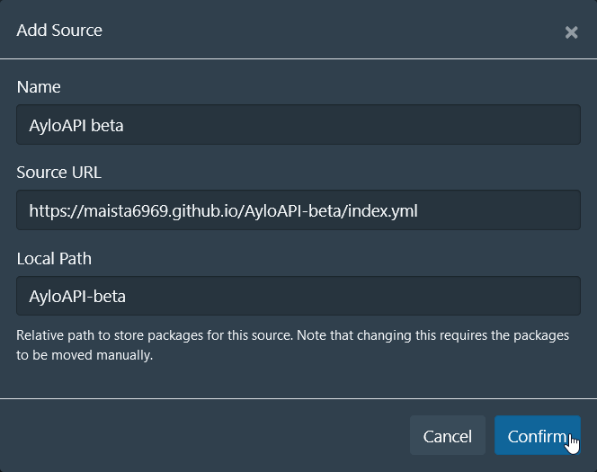

# The Aylo API scraper

This is arguably the biggest scraper in the repo and covers a _lot_ of networks and studios. It needs testing!



| Field      | Value                                                 |
| ---------- | ----------------------------------------------------- |
| Name       | `AyloAPI Beta`                                        |
| Source URL | `https://maista6969.github.io/AyloAPI-beta/index.yml` |
| Local Path | `AyloAPI-beta`                                        |

Note that this scraper cover several sites that already have scrapers in the CommunityScrapers repo and you
may need to uninstall those to get Stash to use this one instead. Note that since the goal is to replace these
any cases where the new scraper is worse than the old one in any way should be considered a bug!

This is a list of conflicting scrapers:

| Community (stable) | AyloAPI-beta       |
| ------------------ | ------------------ |
| BangBros           | BangBros           |
| Brazzers           | Brazzers           |
| Deviante           | Deviante           |
| Deviante Network   | Deviante           |
| MindGeek           | almost all of them |
| MindGeekAPI        | all of them        |
| Twistys            | Twistys            |

## Design goals:

- Easy to modify and understand: documentation, examples, tests?
- Split scrapers that can handle the individual complexities of subnetworks without overcomplicating the main scraper

## Development

The scraper is composed of one [main file](scrapers/AyloAPI/scrape.py) that contains the functions necessary to scrape scenes, movies and performers
from the Aylo API along with a few supporting files with functions that handle things like [constructing URL slugs](scrapers/AyloAPI/slugger.py) and [caching instance tokens](scrapers/AyloAPI/domains.py).

These functions are designed to be open for extension, but closed to modification: but what does this mean?
The networks and studios in the Aylo API differ in how they construct their URLs and even how their
parent/child studio relationships are expressed so these functions could easily end up being very complex
if they were to handle every special case. Instead these scraping functions return their results in a standard format
that works for most studios while also optionally taking a postprocessing function that callers can supply to handle their special requirements.

This postprocessing function can be specific to every sub-network in the Aylo API and encapsulate their quirks.

The standard URL formats the scraper returns look like this:

- scenes: `https://www.<brand-domain>.com/scene/<scene-id>/<scene-title-slug>`
- movies: `https://www.<brand-domain>.com/movie/<movie-id>/<movie-title-slug>`
- performers: `https://www.<brand-domain>.com/model/<performer-id>/<performer-name-slug>`

`brand-domain` is based on the parent studio: `bangbros` for Bang Bros, `gaywire` for Gay Wire,
`bigstr` for BigStr (which has since consolidated under the Czech Hunter name, so those URLs are wrong!)

Uses the `parse_args` helper from [py_common](scrapers/py_common/util.py)
Developed to be ergonomic for testing and integrating into other Python scripts:

```shell
$ python AyloAPI/scrape.py scene-by-url --url "https://www.babes.com/scene/4474211/forbidden-fruit"
d Scene ID: 4327711
t Sending GET request to https://site-api.project1service.com/v2/releases/4327711
d This scene has 13 markers but scraping markers hasn't been implemented yet
{"title": "Forbidden Fruit", <omitted for brevity>}
```

The simplest case is exemplified by the Babes network: they use the standard URL formats and their
parent studio domain `www.babes.com` is correct for all substudios. Their scraper does not need
to make any changes to the results returned by the API, so their scraper is fully defined in [Babes.yml](scrapers/Babes/Babes.yml).
The only thing it needs to do is specify which domains it should use for search, which can be done inline.

```shell
$ python AyloAPI/scrape.py brazzers performer-by-name --name "Zazie Skymm"
d Searching for 'Zazie Skymm' on 1 sites
d Searching babes
t Sending GET request to https://site-api.project1service.com/v1/actors?search=Zazie Skymm&limit=10
d Search finished, found 1 candidates
[{"name": "Zazie Skymm", <omitted for brevity>}]
```

## Testing

The scrapers have all been split and tested manually based on the notes in [the overview](overview.md)
